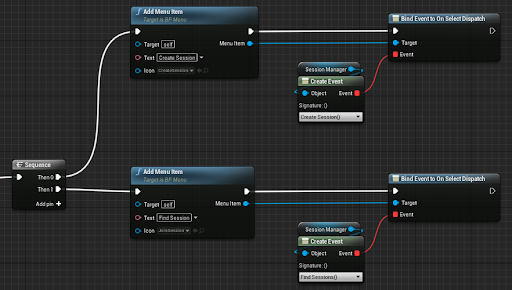
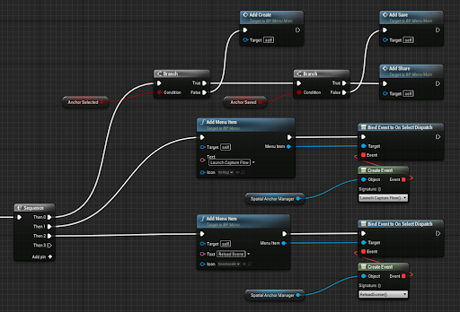
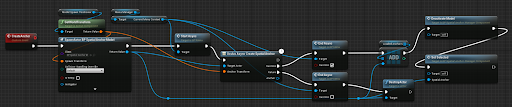
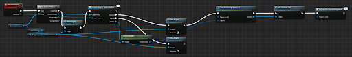
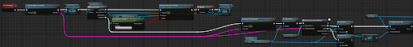
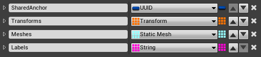
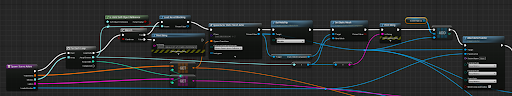
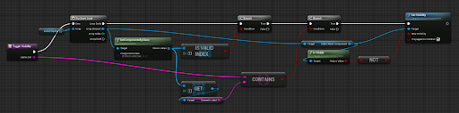

# Shared Scene Sample

This sample app demonstrates a shared scene experience based on [Shared Spatial Anchors](https://developer.oculus.com/documentation/unreal/unreal-shared-spatial-anchors/), [Scene](https://developer.oculus.com/documentation/unreal/unreal-scene-overview/), and [Passthrough](https://developer.oculus.com/documentation/unreal/unreal-passthrough-overview/) in Unreal.

## Project Overview
The sample is built with Blueprint and reuses a significant part of the Shared Spatial Anchors sample and Scene sample. As application starts it loads Lobby level and prompts a user to host or join the session over LAN. Selecting any of these options will load the Shared Spaces level. A host user can:

* Enter the built-in OS scene capture
* Create a shared anchor
* Share scene with other connected users

Joining as a client loads an empty level with Passthrough layer and allows to toggle objects visibility as soon as host shares the scene data.

All Blueprints can be split into the following three categories: User Interface, Spatial Anchors Management, and Scene Reconstruction.

## User Interface

User Interface blueprints correspond to menus attached to controllers. These menus are populated in the runtime and are context dependent. Building blocks for those (BP_Menu, BP_MenuItem) are located in the Blueprints/UI folder as well as an anchor info widget (BP_AnchorIInfo). Blueprint of Lobby menu (BP_Lobby_Menu) is more straightforward and is easier to familiarize with the interface implementation.

{:width="800px"}

Next Event Graph view from BP_Menu_Main demonstrates the Host menu population and alters the content depending on active state (specifically Create, Save, Share).

{:width="800px"}

It’s important to mention BP_MenuManagerComponent (a component of BP_SharedSpacesPawn) containing basic and utility code to update menu position, navigation, selection, etc. To notify a user of continuous (async) operations the menu provides Start Async and End Async utilities that you can find in other Blueprints.

## Spatial Anchors Management

High level Spatial Anchors management blueprint (BP_SpacialAnchorManagementComponent) is also a part of BP_SharedSpacesPawn and provides functionality to create, save, load, share, etc. spatial anchors, it translates calls to lower level API and provides delegates for async operations.The implementation is similar to a dedicated sample of Shared Statial Anchors, and our’s sample features anchors creation, and storing it to a cloud.

{:width="800px"}

{:width="800px"}

Both operations are asynchronous and trigger corresponding event dispatch handled in BP_MenuManagerComponent with Update Main Menu. Sharing anchor data and retrieving it on a Client are explained in the next section.

## Scene Reconstruction
The scene sharing starts with an anchor sharing from BP_SpacialAnchorManagementComponent and follows the scene info serialization. The Host shares the anchor with connected Clients based on available Meta user IDs obtained from Online Subsystem.

{:width="800px"}

Scene info contains ID of the shared anchor, arrays with label, transform in the shared anchor reference frame, and reference to static mesh for each scene object. This structure is defined as BP_Scene in the Blueprints folder.



Immediately after serialization this structure is multicasted (with NetMulticast_LoadScene from BP_OculusSceneActor) to all clients to retrieve the anchor and reconstruct the scene. The blueprint function SpawnSceneActors to spawn static mesh actors is also in BP_OculusSceneActor.

{:width="800px"}

As it is obvious from the name BP_OculusSceneActor inherits the OculusSceneActor providing basic Scene API functionality for Host, and is directly placed on the SharedSpaces map.

In addition, semantic labels of the scene actors are stored on Clients to toggle groups visibility from Event Graph of BP_OculusSceneActor with blueprint function ToggleVisibility.

{:width="800px"}


## How to Use

### Prerequisites

You must follow the [prerequisites steps described in here](https://developers.meta.com/horizon/documentation/unreal/unreal-spatial-anchors-sharing#prerequisites) otherwise anchor sharing will not work. Be prepared to spend at least a few hours going through these steps as they are not trivial. Here is a checklist of steps you need to take:

1. Create an organisation on the Meta Quest developer dashboard (if you don't have one already)
2. Create an application in your organisation to host this sample
3. Add User ID and User Profile platform features to your application in Data Use Checkup
4. Create test users to avoid waiting for Data Use Checkup review (optional)
5. Change `[OnlineSubsystemOculus]` > `MobileAppId` in `DefaultEngine.ini` of this sample to match the ID of your app in the developer dashboard
6. Change `[/Script/AndroidRuntimeSettings.AndroidRuntimeSettings]` > `PackageName` in `DefaultEngine.ini` of this sample to a unique name, for example `com.<yourorg>.UnrealSharedSceneSample`
7. [Configure your app to upload to the Meta Quest developer dashboard](https://developers.meta.com/horizon/documentation/unreal/unreal-platform-tool) and upload it
8. Login to your Quest devices with the test users you created earlier (optional)
9. Download and install the sample app through the Meta Quest store

### Load the project

First, ensure you have Git LFS installed by running this command:
```sh
git lfs install
```

Then, clone this repo using the "Code" button above, or this command:
```sh
git clone https://github.com/oculus-samples/Unreal-SharedSceneSample
```

### Launch the project in the Unreal Editor using one of the following options.

#### Epic Games Launcher with MetaXR plugin

The easiest way to get started is to use the prebuilt Unreal Engine from the Epic Games Launcher, with MetaXR plugin.

1. Install the [Epic Games Launcher](https://www.epicgames.com/store/en-US/download)
2. In the launcher, install UE5 (recommended).
3. Download and install the MetaXR plugin from the [Unreal Engine 5 Integration download page](https://developer.oculus.com/downloads/package/unreal-engine-5-integration).
4. Launch the Unreal Editor
5. From "Recent Projects", click "Browse" and select `SharedSceneSample.uproject`

#### Meta fork of Epic’s Unreal Engine

The Meta fork of Epic’s Unreal Engine will give you the most up to date integration of Oculus features. However, you must build the editor from its source.

Follow the instructions on [Accessing Unreal Engine source code on GitHub](https://www.unrealengine.com/en-US/ue-on-github) to obtain:
- an Epic account
- a GitHub account
- authorization to access the Unreal Engine source repository
Disregard instructions on downloading Epic’s Unreal Engine source code as you will be building the Meta fork of Epic’s Unreal Engine source.

Make sure you have Visual Studio installed properly:
- Launch the Visual Studio Installer and click Modify for the Visual Studio version you want to use.
- Under the Workloads tab, click Game development with C++ if it isn’t checked and then click Modify.

1. Download the source code from the [Meta fork of Epic’s Unreal Engine on GitHub](https://github.com/Oculus-VR/UnrealEngine).
2. Open a command prompt in the root of the Unreal, then run this command:
```sh
.\GenerateProjectFiles.bat -Game SharedSceneSample -Engine <full path to Unreal-SharedSceneSample directory>\SharedSceneSample.uproject
```
3. Open the `SharedSceneSample.sln` file that has been generated in the `Unreal-SharedSceneSample` directory.
4. Set `SharedSceneSample` as the start-up project and `Development Editor` as the configuration.
5. Hit `F5` to build and debug the project (and the engine).
    - Depending on your machine, the build may take awhile to complete.

# Licenses
The Meta License applies to the SDK and supporting material. The MIT License applies to only certain, clearly marked documents. If an individual file does not indicate which license it is subject to, then the Meta License applies.
